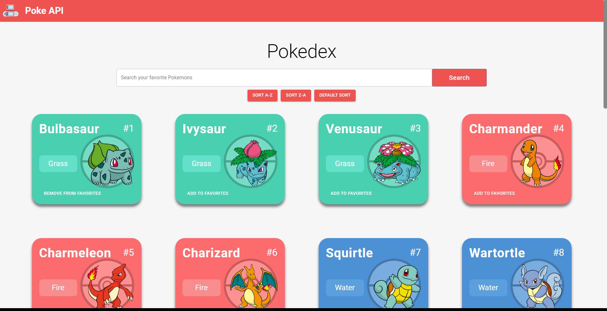
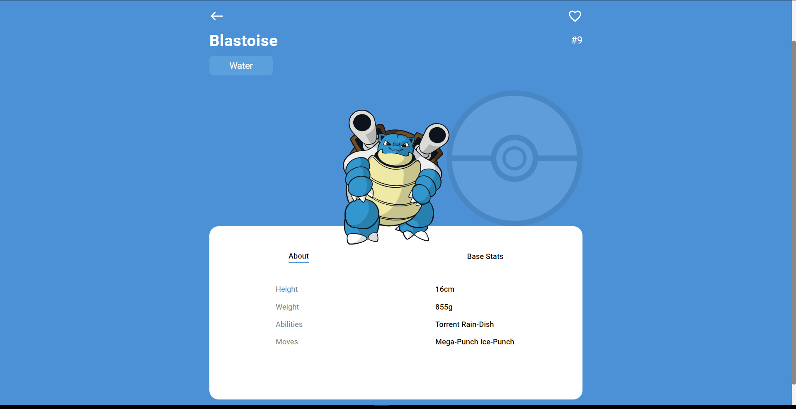

<!-- PROJECT LOGO -->

  <h1 align="center">Pokedex</h1>

  <h3 align="center">
   Browse your favorite Pokemons!
  </h3>
  
 
 ### Click here for live demo   <a href="https://pokedexapp-clone.netlify.app">Pokedex</a>

<!-- ABOUT THE PROJECT -->

## About The Project:

### Homepage:

On the homepage the user can see top pokemons, search them by name or sort them A-Z, Z-A or default (by their ID)

### Character Page:

On the Pokemon detail page the user can see detailed information about the Pokemon

#### The common funtionalities are:

-View Top Pokemons: The homepage displays a list of top Pokemons. These Pokemons are fetched from the Pokemon API and are shown as cards with their names and images.

-Search by Name: The app provides a search feature where users can search for Pokemons by their name. And even sort them by name (A-Z, Z-A) or Default (by their ID, 1-1000).

-Detailed Pokemon Information: When a user clicks on a Pokemon card, they are taken to a detailed view of that Pokemon. This view displays comprehensive information about the Pokemon, including its stats, abilities, and other details.

-Add to Favorites: Users have the ability to add Pokemons to their favorites list. They can click on a button or an icon to add a Pokemon to their favorites collection.

-Remove from Favorites: Users can also remove Pokemons from their favorites list. By clicking on a button or an icon, they can remove a Pokemon from their favorites collection, customizing their list based on their preferences.

-Pagination: The app supports pagination to allow users to navigate through multiple pages of Pokemons. The pagination controls, such as "Next" and "Previous" buttons, enable users to browse more Pokemons beyond the initial page.

-Loading State: A loading state is implemented to provide visual feedback to users while fetching data from the Pokemon API. During the loading state, a loading indicator is displayed to inform the user that the app is retrieving data.

-Error Handling: In case of any errors during the data fetching process or API requests, the app gracefully handles the errors. An error message is displayed to inform the user about the issue and provide appropriate instructions.

I'm using [poke api](https://pokeapi.co) to get pokemons.

##### Credit: poke api

### Built With

- #### ReactJS
- #### Material UI
- #### poke api

### Key concepts:

- #### Material UI
- #### Fetching data from an API
- #### Handling events
- #### String manipulation
- #### Filtering data
- #### JavaScript Object Oriented Programming
- #### React Hooks
- #### React components
- #### React state and props
- #### Routing and Navigation
- #### Conditional Rendering
- #### Component Styling
- #### State Management
- #### Responsive Design

<!-- GETTING STARTED -->

# Getting Started

## After cloning github repository

### To install all dependency necessary:

### `npm i`

This project was bootstrapped with [Create React App](https://github.com/facebook/create-react-app).

## Available Scripts

### To run project:

### `npm start`

### To build project:

### `npm run build`
